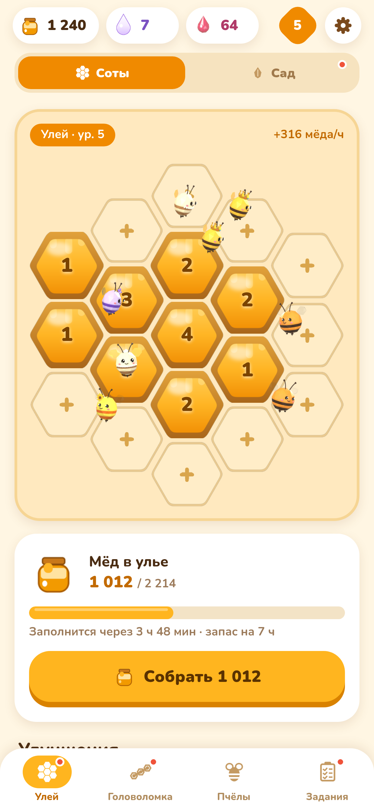
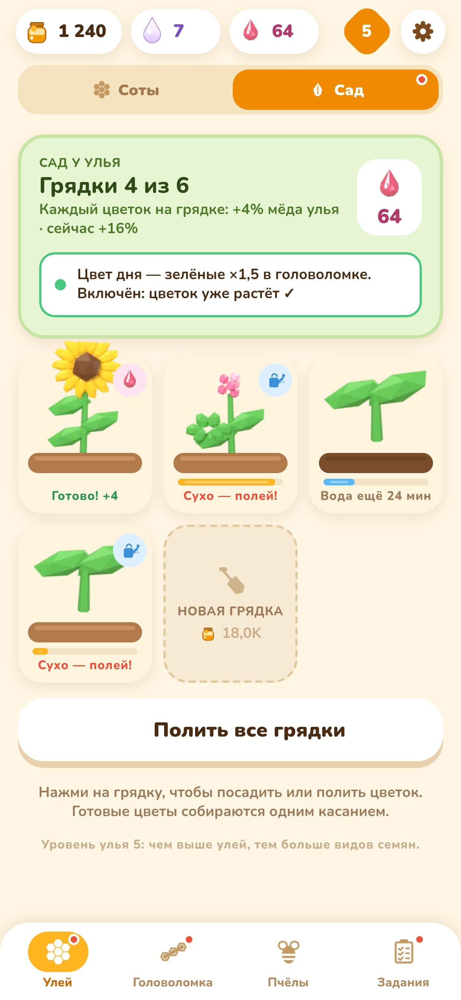
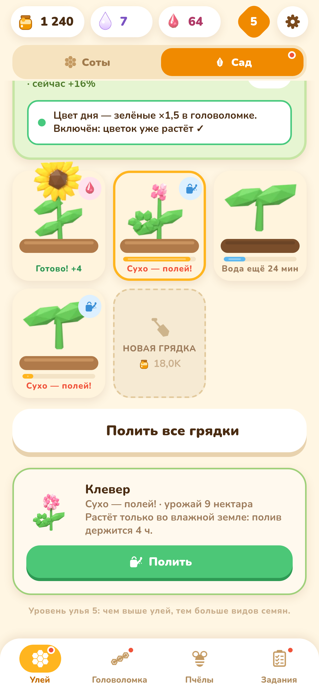
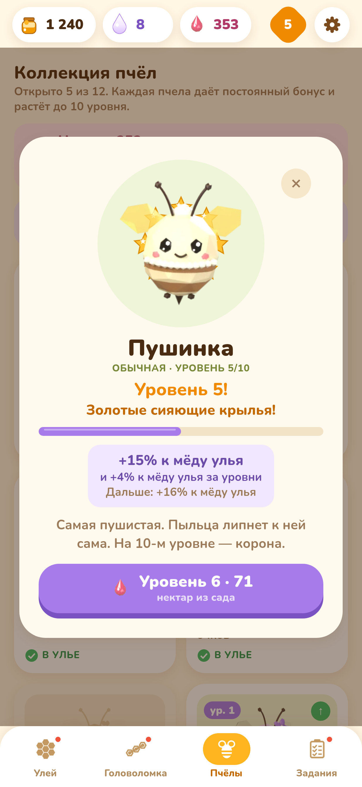
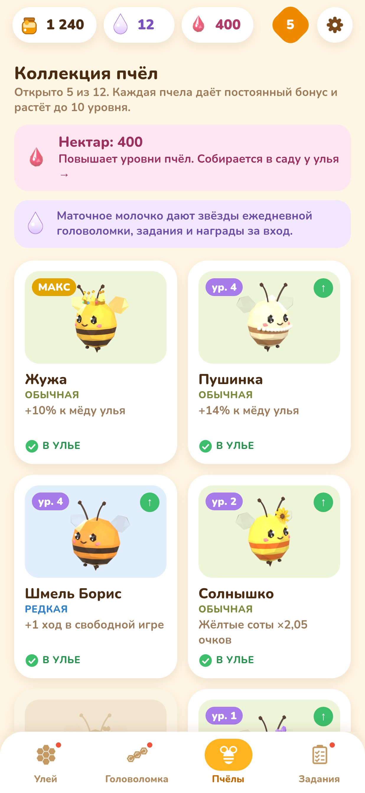
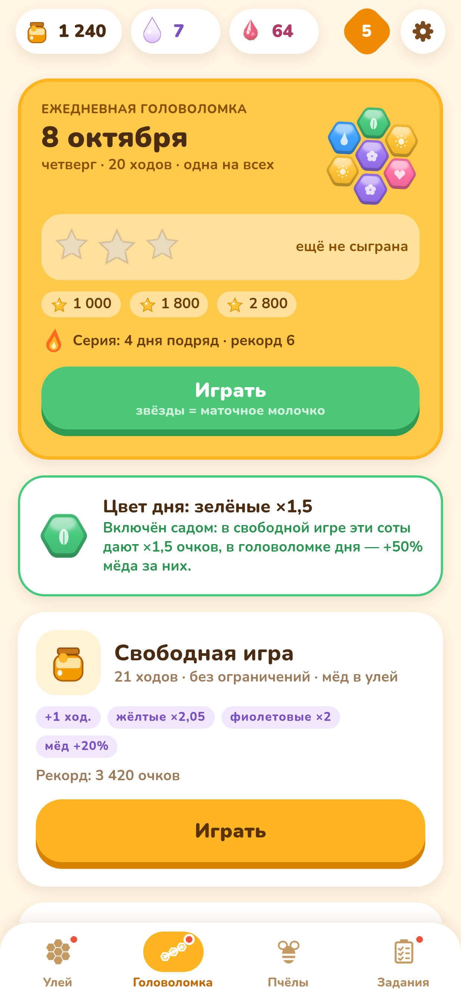
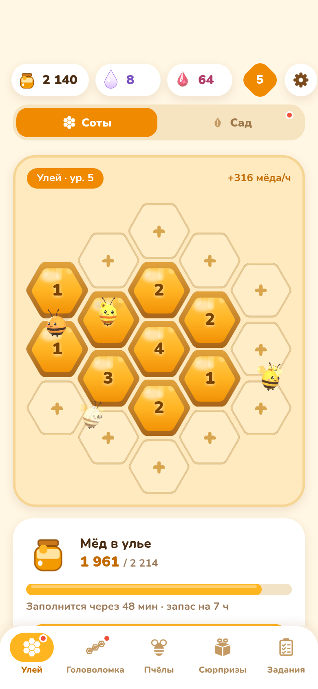

# Buzzle — cozy hive + honeycomb puzzle (Android)

**Buzzle** is a cozy portrait-mode casual game: grow a bee hive that makes honey even while the app is
closed, and earn more by solving a daily hexagonal honeycomb puzzle. Fully offline, no account, no ads —
everything is stored on the device. UI language: Russian.


## Features

- **Hive idle** — 19 comb slots on a hex grid; build next to existing combs and upgrade each up to level 20.
  Bees produce honey offline up to the storage limit; four global upgrades (workers, storage, flower
  meadow, queen's chamber).
- **Honeycomb puzzle** — drag across 3+ neighbouring cells of one colour. Chains of 6+ leave a royal-jelly
  bomb (bombs can chain-react), rainbow jokers, combo multiplier for 5+ chains.
  - **Daily puzzle**: one seed per calendar day for everyone, 20 moves, 1–3 stars, day streaks.
  - **Free play**: unlimited rounds with all bee bonuses active.
- **12 bee species** with permanent bonuses, unlocked with royal jelly, and **bee levels 1–10 (v1.2)**: levelling
  costs nectar (plus royal jelly at levels 5 and 10). Each level grows the bee's ability and adds +1% hive
  honey. Level 5 gives golden wings and level 10 a crown.
- **Flower garden (v1.2)** — up to 6 beds next to the hive (more unlock with honey). Plant seeds (sunflower,
  clover, lavender, cornflower, mint) and water them. Flowers only grow while the soil is wet, and one watering
  lasts 4 h. Grow timers run offline with clock-rollback protection. Flowers give **nectar** and +4% hive honey
  per planted bed. A planted flower of the **colour of the day** turns on ×1.5 for that colour in the puzzle.
  Optional garden reminders ("цветы распустились" / "сад хочет пить") follow the existing reminder setting and
  quiet hours.
- **Surprise combs (v1.3)** — loot boxes for in-game play only (no purchases): wooden (3 daily tasks), wax (3★ daily
  puzzle, weekly chest, weekend puzzle), golden (every 7-day streak, 3★ weekend, rare bonus inside wax/wood), royal
  (locked until seasons). Drops: honey/nectar/jelly, seeds incl. rare **лунный мак** and **золотой подсолнух**,
  8 bee skins (overlay layers per view, any bee), 8 hive/garden decorations, boosters (+3 moves, start bomb,
  shuffle — free play only), fragments of the 13th bee **Ночная пчела** (10 = bee). Rarities common/rare/epic/
  legendary with odds shown in game, pity (epic ≤10, legendary ≤30 golden combs), duplicates → collection pollen
  for the shop, collection album with page bonuses. Deterministic seeded RNG (no re-rolls), 3-tap opening with
  bees gathering, burst + haptics, «Открыть все».
- **Weekly layer (v1.3)** — weekly chest for 15 tasks, weekend puzzle (Sat/Sun, 30 moves, own stars), streak
  freeze (4 jelly, once a week), new task types for the garden and bee levels.
- **Save export/import (v1.3)** — text code `BUZZLE1.…` with checksum (Android share sheet / web clipboard + .txt
  file); «Пригласить друга» via Telegram `openTelegramLink` → t.me/share/url, system share on Android.
- **Daily loop** — 7-day login calendar with a chest, 3 daily tasks + daily chest, optional reminders
  ("hive is full", "daily puzzle is waiting").
- **Living bees (v1.1)** — layered bee sprites (body + flapping wings + blinking eyes) fly organic curved
  loops around the hive, bank into turns, land on combs for a little "work" wiggle, swarm to the honey
  counter when you collect, and zip across the board on big combos. All motion runs on the native
  animation driver and pauses in the background.
- **Bee names (v1.2.1).** Tap the pencil in a bee's detail sheet to rename it: up to 16 characters, emoji count as
  one character, and an empty name resets it. The custom name replaces the species name everywhere it is shown, and
  the species stays as the subtitle. Names are saved with the rest of the game, in the Android save and in Telegram
  CloudStorage.
- **Low-poly bees (v1.2)** — every bee (hive, puzzle zip, collection, tutorial, tasks, splash, app icon) is
  rendered in Blender as baked layers (body, wings, eyes, plus golden wings and a crown for levels). Each
  species has 3 views (Жужа has 5), so bees turn toward their flight direction.
- Clock-rollback protection, tolerant save migration with backups (v1.1 saves migrate to v2 on first launch), haptics.

## Screenshots

| Hive & low-poly bees | Garden | Garden bed | Bee level-up | Bee collection | Colour of the day |
|---|---|---|---|---|---|
|  |  |  |  |  |  |

| Honey swarm | Big combo | Daily puzzle | Tasks |
|---|---|---|---|
|  |  |  |  |

All screenshots in `screens/` are rendered from the real app code (react-native-web + puppeteer with a
fixed clock and seeded save; the puzzle is played with real drag gestures). Style explorations live in
`design/` (`buzzle-*.png`, `art-*.png`, low-poly bee options in `design/bees3d/`, roadmap in `design/ROADMAP.ru.md`).

## Telegram Mini App (web)

Buzzle also runs as a **Telegram Mini App**. Open [@Buzzle_game_bot](https://t.me/Buzzle_game_bot) and press **«Играть»**.
The same build works in a normal mobile browser: https://inm1nd.github.io/buzzle/



- **Same code as Android.** The game logic and balance are identical to Android v1.2. The web build comes from the
  same Expo / react-native-web code.
- **Telegram integration** (`src/platform/telegram.ts`, loaded via `telegram-web-app.js`):
  - Startup calls `ready()`, `expand()` and `requestFullscreen()` (mobile clients, Bot API 8.0+), plus portrait lock.
  - `disableVerticalSwipes()` stops a drag in the puzzle from closing the app. The board also has `touch-action: none`.
  - The header, background and bottom-bar colours follow the game.
  - The Telegram **BackButton** mirrors in-app navigation (`src/platform/back.ts`).
  - **HapticFeedback** replaces expo-haptics (`src/ui/haptics.web.ts`).
  - The layout keeps clear of `safeAreaInset` + `contentSafeAreaInset` (`src/platform/insets.ts`).
- **Saves.** Inside Telegram the save goes to **CloudStorage**, so progress follows the Telegram account across devices.
  - It is chunked (≤3800 chars per value) into two alternating slots plus a meta key, so a broken write never
    damages the previous save (`src/platform/cloudSave.ts`).
  - Writes are debounced (4 s) and flushed when the app is hidden.
  - `localStorage` stays as a cache and as the store outside Telegram.
  - An existing browser save is uploaded on the first Telegram launch. When a newer save exists on another device,
    it wins.
- **Reliable images (1.2.1).** react-native-web's `<Image>` reloads its URL on every mount and stays blank if that one
  request fails. The tab bar remounts after each puzzle round, so on a flaky mobile connection its icons could vanish.
  Two fixes:
  - Tab icons are now pre-tinted inline data URIs (`src/ui/TabIcon.web.tsx`), so they never touch the network and
    need no SVG tint filter.
  - All other art is loaded once at startup and kept in memory, with retries (`src/platform/pinArt.web.ts`).
  `scripts/telegram/tabs-stress.cjs` checks this: it switches tabs, plays rounds, backgrounds and resizes the app on a
  flaky network, and after every step verifies that each tab icon is actually drawn.
- **Reminders** are not available on the web yet (no backend); the settings show «скоро».
- **Performance.** The JS bundle is ≈ 724 KB (≈ 207 KB gzipped) and the whole site ≈ 1.6 MB (WebP art). An HTML boot
  screen with Жужа shows until the save is loaded. Web animations run on the JS thread, so the hive shows 4 flying bees
  instead of 8.

```bash
scripts/telegram/build-web.sh                 # -> dist-web/ (base path /buzzle; BZZ_WEB_BASE overrides)
NODE_PATH=/path/to/node_modules node scripts/telegram/smoke.cjs http://127.0.0.1:8098/buzzle/   # mocked Telegram + plain browser
NODE_PATH=/path/to/node_modules node scripts/telegram/tabs-stress.cjs http://127.0.0.1:8098/buzzle/ 6  # tab icons stress test
scripts/telegram/deploy-pages.sh              # dist-web -> gh-pages branch (GITHUB_TOKEN_PUSH)
node scripts/telegram/setup-bot.mjs           # menu button «Играть», descriptions, /start (TELEGRAM_BOT_TOKEN)
```

## Tech stack

- **Expo SDK 57**, **React Native 0.86** (New Architecture, Hermes), **TypeScript**
- Animations: React Native `Animated` with `useNativeDriver` only — pre-computed Catmull-Rom flight paths
  (`src/logic/flight.ts`) sampled into native interpolations, shared wing-flap clocks, no JS per frame
- `@react-native-async-storage/async-storage`, `expo-notifications`, `expo-haptics`
- Bees and flowers: low-poly models built and rendered by script in **Blender 4.2** (`scripts/bees3d/`), packed
  into WebP layers + generated `src/ui/beeArt.ts`. UI art made with Python/Pillow (`scripts/make_art.py`,
  `scripts/make_art_v12.py`). Nunito font (SIL OFL 1.1)
- Tests: `node:test` via `tsx` (game logic, puzzle, flight paths) and Jest + React Native Testing Library (UI)
- Local Gradle release build (no EAS): arm64-v8a only, R8 + resource shrinking, uncompressed 16 KB-aligned
  native libraries, APK signature schemes v1 + v2 + v3

## Project layout

| Path | What |
|---|---|
| `src/logic/` | pure game logic: hex grid, board/puzzle, economy, bees + levels, garden, tasks, daily seed, notifications plan, flight paths |
| `src/screens/` | Hive, Garden, Puzzle hub, Game, Bees, Tasks, modals (tutorial, rewards, settings) |
| `src/platform/` | web / Telegram bridge: WebApp SDK, BackButton, safe areas, CloudStorage save |
| `src/ui/` | theme, components, `BeeSprite` / `anim` (animation plumbing), reward flights, notifications |
| `assets/art/` | generated art: `bees/` and `garden/` (low-poly WebP layers), combs, icons |
| `scripts/` | art & font generators, `bees3d/` (Blender pipeline), `simulate.ts` (balance bots), `configure-android.sh`, `verify-apk.sh`, web screenshot harness |
| `tests/`, `tests-rn/` | logic tests and UI tests |

## Build

Requirements: Node 22, JDK 17, Android SDK + NDK (`env.sh` puts them on the PATH).

```bash
. ./env.sh
npm install
npx tsc --noEmit && npm test && npx jest

# release APK
CI=1 npx expo prebuild --platform android --clean --no-install
./scripts/configure-android.sh     # arm64-only, R8, stored 16 KB-aligned libs, release signing v1+v2+v3
cd android && ./gradlew assembleRelease --no-daemon --console=plain
cd .. && cp android/app/build/outputs/apk/release/app-release.apk Buzzle-v1.3.0.apk
scripts/verify-apk.sh Buzzle-v1.3.0.apk   # aapt, apksigner, zipalign -P 16, ELF alignment, JS bundle
```

### Low-poly bee art

```bash
B=~/opt/blender-4.2.3-linux-x64/blender
python3 scripts/bees3d/jobs.py /tmp/beer/bees > /tmp/beer/jobs.json   # 12 species × views, shared wings/crown, icon
$B -b -P scripts/bees3d/render_lowpoly.py -- /tmp/beer/jobs.json
$B -b -P scripts/bees3d/render_flowers.py -- /tmp/beer/flowers 192
python3 scripts/bees3d/pack.py /tmp/beer/bees /tmp/beer/flowers   # crop -> WebP, beeArt.ts, app icons
```

### Balance

`npx tsx scripts/simulate.ts` runs casual (3 visits/day) and active (6 visits/day) bots through the real game
actions for 90 days. Current results:

| Bot | all 12 bees | first L5 | all L5 | first L10 | all L10 | 6 beds |
|---|---|---|---|---|---|---|
| casual | day 32 | day 34 | day 44 | day 56 | day 80 | day 9 |
| active | day 14 | day 15 | day 21 | day 44 | day 62 | day 7 |

### Signing

Release signing reads `keystore/keystore.properties`, which is **not** in git. Copy
`keystore/keystore.properties.example`, put your keystore next to it and fill in your own passwords — see
`keystore/README.md`. Updates only install over an existing app when signed with the same key, so keep a
backup of the keystore. Keystores, passwords, APKs and large build logs are git-ignored.

### Screenshots

```bash
npx tsx scripts/web-screens/seed.ts                 # -> /tmp/bzz-seeds.json
CI=1 npx expo export -p web --output-dir dist && mkdir -p dist/fonts && cp assets/fonts/Nunito-*.ttf dist/fonts/
python3 scripts/web-screens/inject.py
(cd dist && python3 -m http.server 8099 --bind 127.0.0.1) &
node scripts/web-screens/shoot.mjs                  # needs puppeteer-core + Chrome
python3 scripts/web-screens/overview.py
```

## License

MIT, see [LICENSE](LICENSE). Font: Nunito, SIL Open Font License 1.1 (`assets/fonts/LICENSE.txt`).
