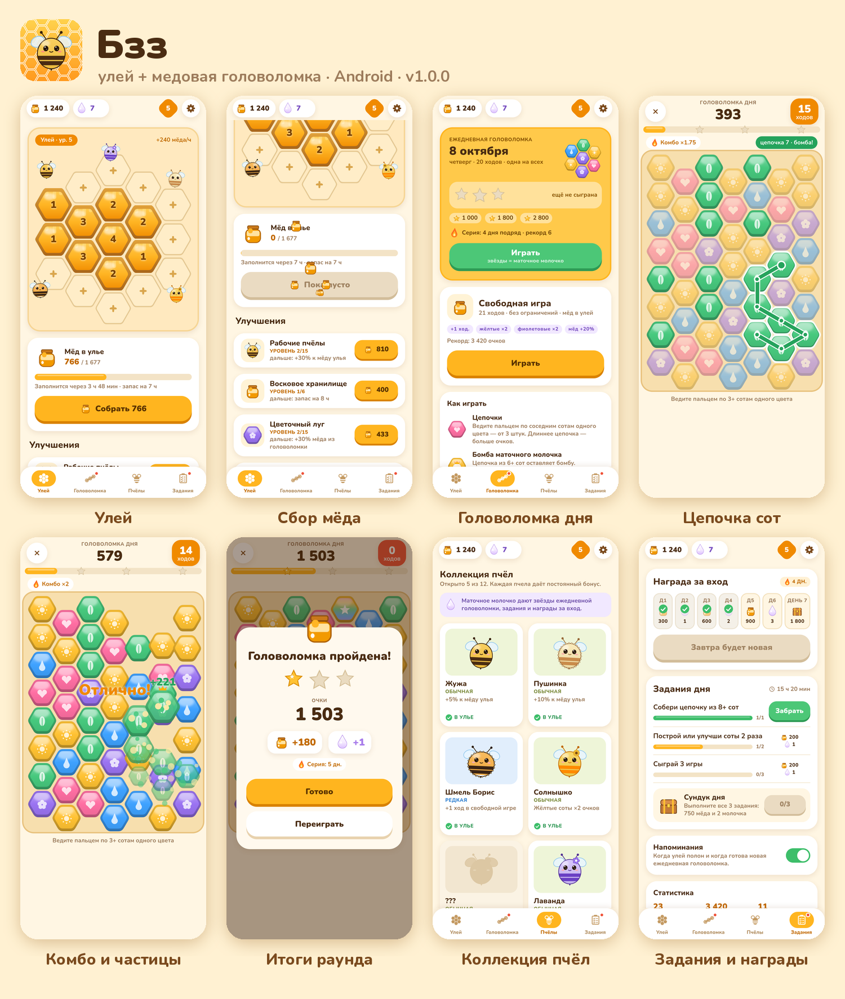
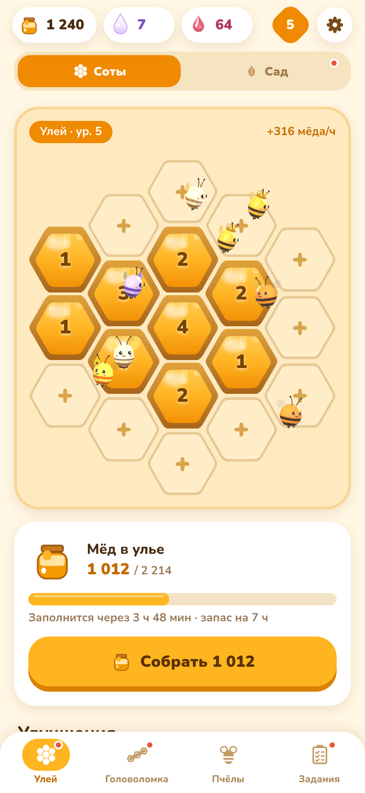
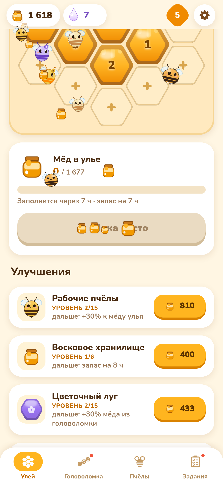
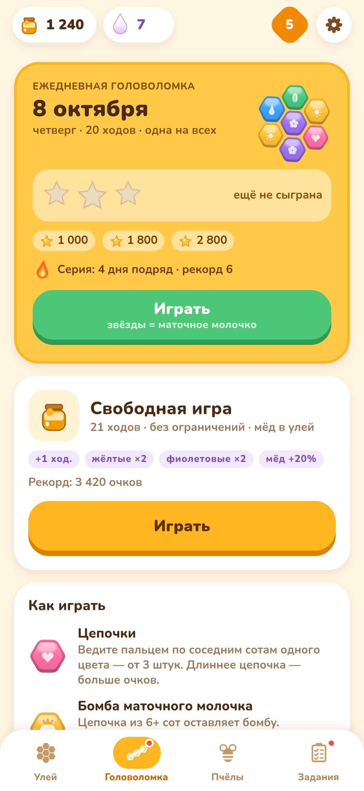
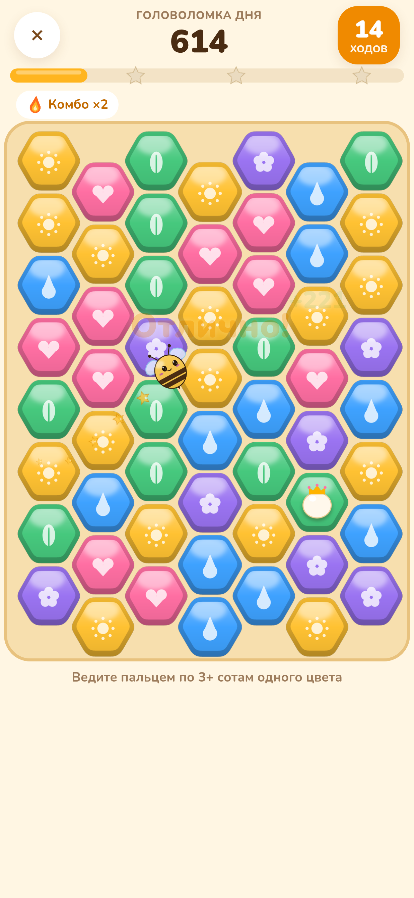
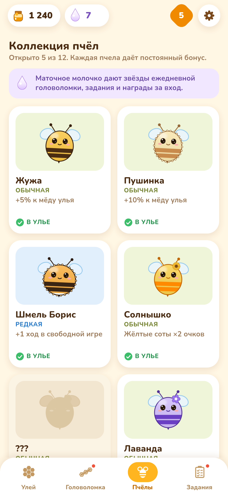
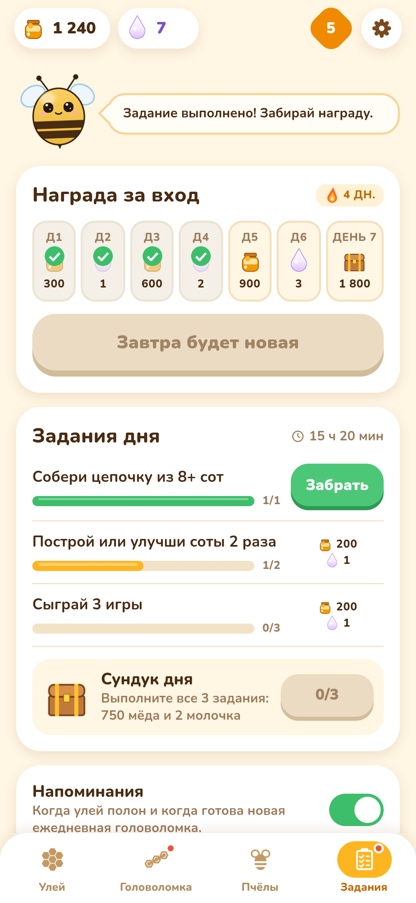

# Buzzle — cozy hive + honeycomb puzzle (Android)

**Buzzle** is a cozy portrait-mode casual game: grow a bee hive that makes honey even while the app is
closed, and earn more by solving a daily hexagonal honeycomb puzzle. Fully offline, no account, no ads —
everything is stored on the device. UI language: Russian.



## Features

- **Hive idle** — 19 comb slots on a hex grid; build next to existing combs and upgrade each up to level 20.
  Bees produce honey offline up to the storage limit; four global upgrades (workers, storage, flower
  meadow, queen's chamber).
- **Honeycomb puzzle** — drag across 3+ neighbouring cells of one colour. Chains of 6+ leave a royal-jelly
  bomb (bombs can chain-react), rainbow jokers, combo multiplier for 5+ chains.
  - **Daily puzzle**: one seed per calendar day for everyone, 20 moves, 1–3 stars, day streaks.
  - **Free play**: unlimited rounds with all bee bonuses active.
- **12 bee species** with permanent bonuses, unlocked with royal jelly.
- **Daily loop** — 7-day login calendar with a chest, 3 daily tasks + daily chest, optional reminders
  ("hive is full", "daily puzzle is waiting").
- **Living bees (v1.1)** — layered bee sprites (body + flapping wings + blinking eyes) fly organic curved
  loops around the hive, bank into turns, land on combs for a little "work" wiggle, swarm to the honey
  counter when you collect, and zip across the board on big combos. All motion runs on the native
  animation driver and pauses in the background.
- Clock-rollback protection, tolerant save migration with backups, haptics, all art drawn in code.

## Screenshots

| Hive & bees | Honey swarm | Daily puzzle | Big combo | Bee collection | Tasks |
|---|---|---|---|---|---|
|  |  |  |  |  |  |

All screenshots in `screens/` are rendered from the real app code (react-native-web + puppeteer with a
fixed clock and seeded save; the puzzle is played with real drag gestures). Style explorations live in
`design/` (`buzzle-*.png`, `art-*.png`).

## Tech stack

- **Expo SDK 57**, **React Native 0.86** (New Architecture, Hermes), **TypeScript**
- Animations: React Native `Animated` with `useNativeDriver` only — pre-computed Catmull-Rom flight paths
  (`src/logic/flight.ts`) sampled into native interpolations, shared wing-flap clocks, no JS per frame
- `@react-native-async-storage/async-storage`, `expo-notifications`, `expo-haptics`
- Art generated with Python/Pillow (`scripts/make_art.py`); Nunito font (SIL OFL 1.1)
- Tests: `node:test` via `tsx` (game logic, puzzle, flight paths) and Jest + React Native Testing Library (UI)
- Local Gradle release build (no EAS): arm64-v8a only, R8 + resource shrinking, uncompressed 16 KB-aligned
  native libraries, APK signature schemes v1 + v2 + v3

## Project layout

| Path | What |
|---|---|
| `src/logic/` | pure game logic: hex grid, board/puzzle, economy, bees, tasks, daily seed, notifications plan, flight paths |
| `src/screens/` | Hive, Puzzle hub, Game, Bees, Tasks, modals (tutorial, rewards, settings) |
| `src/ui/` | theme, components, `BeeSprite` / `anim` (animation plumbing), reward flights, notifications |
| `assets/art/` | generated PNGs (bee bodies, wings, eyes, combs, icons) |
| `scripts/` | art & font generators, `configure-android.sh`, `verify-apk.sh`, web screenshot harness |
| `tests/`, `tests-rn/` | logic tests and UI tests |

## Build

Requirements: Node 22, JDK 17, Android SDK + NDK (`env.sh` puts them on the PATH).

```bash
. ./env.sh
npm install
npx tsc --noEmit && npm test && npx jest

# release APK
CI=1 npx expo prebuild --platform android --clean --no-install
./scripts/configure-android.sh     # arm64-only, R8, stored 16 KB-aligned libs, release signing v1+v2+v3
cd android && ./gradlew assembleRelease --no-daemon --console=plain
cd .. && cp android/app/build/outputs/apk/release/app-release.apk Buzzle-v1.1.0.apk
scripts/verify-apk.sh Buzzle-v1.1.0.apk   # aapt, apksigner, zipalign -P 16, ELF alignment, JS bundle
```

### Signing

Release signing reads `keystore/keystore.properties`, which is **not** in git. Copy
`keystore/keystore.properties.example`, put your keystore next to it and fill in your own passwords — see
`keystore/README.md`. Updates only install over an existing app when signed with the same key, so keep a
backup of the keystore. Keystores, passwords, APKs and large build logs are git-ignored.

### Screenshots

```bash
npx tsx scripts/web-screens/seed.ts                 # -> /tmp/bzz-seeds.json
CI=1 npx expo export -p web --output-dir dist && mkdir -p dist/fonts && cp assets/fonts/Nunito-*.ttf dist/fonts/
python3 scripts/web-screens/inject.py
(cd dist && python3 -m http.server 8099 --bind 127.0.0.1) &
node scripts/web-screens/shoot.mjs                  # needs puppeteer-core + Chrome
python3 scripts/web-screens/overview.py
```

## License

MIT, see [LICENSE](LICENSE). Font: Nunito, SIL Open Font License 1.1 (`assets/fonts/LICENSE.txt`).
